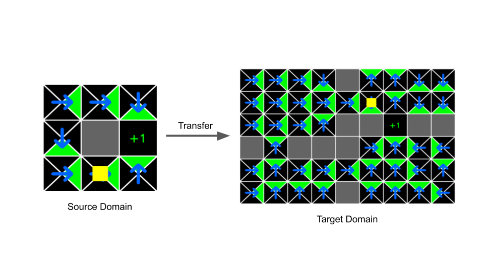
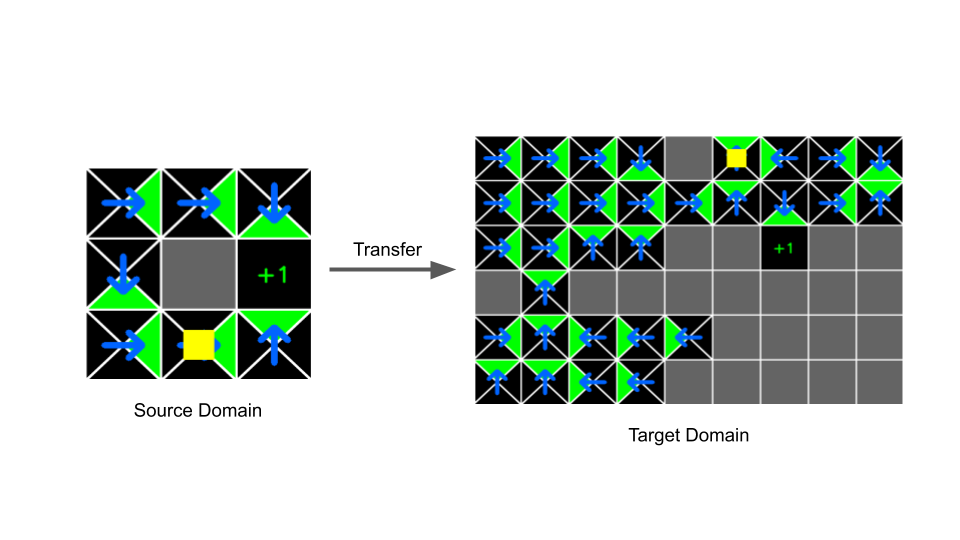

# Bisimulation Policy Transfer

Python implementation of the paper Castro et al. [**Using bisimulation for policy transfer in MDPs**](https://dl.acm.org/citation.cfm?id=2898777) AAAI-2010 <br />
**Note**: This repository is still under development.

## Getting Started
This project requires Python 3.5 <br />
Follow the instructions on installing the necessary prerequisites and running the code.

### Requirements
For PyEMD, please clone my [PyEMD fork](https://github.com/madan96/pyemd/tree/master) and follow its installation instructions.

To install the other necessary prerequisites use
```pip install -r requirements.txt```

### How to Run

Train Q-Learning agent on small world using

```python q_learning.py --env-name FourSmallRooms_11```

Run Policy Transfer for 8 to 44 states using

```python run_transfer.py --transfer optimistic --tgt-env FourLargeRooms --solver pyemd```

## Results

Policy transfer result for transfer between FourSmallRoom env to FourLargeRoom env <br/>


Policy transfer result for transfer between FourSmallRoom env to ThreeLargeRoom env


## References
* Using Bisimulation for Policy Transfer in MDPs [[Paper](https://dl.acm.org/citation.cfm?id=2898777)]
* Custom RL-Gridworld repo [Link](https://github.com/WojciechMormul/rl-grid-world)

## Credits
[Rishabh Madan](https://github.com/madan96) <br/>
[Anirban Santara](https://github.com/santara) <br/>
[Pabitra Mitra](http://cse.iitkgp.ac.in/~pabitra/) <br/>
[Balaraman Ravindran](https://www.cse.iitm.ac.in/~ravi/)

